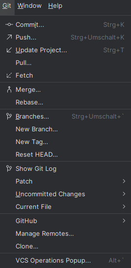

# Modul Moderne Softwareentwicklung

## Was ist Git und warum sollte es verwendet werden?

1. Während andere Versionskontrollsystemen nur die Unterschiede in den Änderungen speichern, erstellt  Git häufig "Snapshots" der Dateien. Das bringt viele Vorteile, besonders jedoch hinsichtlich des Branchings.
   
2. Außerdem legt Git großen Wert auf die Sicherheit und Integrität der Daten. Jeder Commit erhält einen eindeutigen SHA-1-Hashwert, der sicherstellt, dass nachträgliche Änderungen oder Vertuschungen nicht möglich sind. Dies ermöglicht auch die Wiederherstellung von früheren Versionen.
   
3. Der Großteil der Arbeit mit Git erfolgt zudem lokal, was nützlich ist, wenn man unterwegs ist oder temporär keinen Internetzugang hat.

4. Git besitzt eine gewisse "Zeitmaschinen-Funktionalität" es ist möglich, mutige Änderungen zu testen und problemlos anzunehmen oder zu verwerfen. Git fördert somit eine dynamische und risikofreudige Arbeitsweise.
   
5. Des Weiteren fördert Git Branching, also das Erstellen von Verzweigungen (Branches), was eine flexible und parallele Entwicklung ermöglicht.
   
6. Git-Repositories können eine hierarchische Struktur bilden, bei der viele Klone für die Entwicklung verwendet werden und ein Master-Repository alle Änderungen sammelt.
   
 

## Grundlegende Git-Befehle

### git status
git status gibt an, welche Dateien geändert wurden und in welchem Zustand diese sich befinden (getrackt oder nicht getrackt)


### git add
Das Kommando git add wird verwendet, um Dateien oder Verzeichnisbäume unter die Versionskontrolle von Git zu stellen. Es kann sowohl neue als auch geänderte Dateien zum Staging-Bereich hinzufügen. Mit diesem Befehl bereitet Git alles für den nächsten Commit vor, indem es den Snapshot bzw. das Index-Update aktualisiert.


git add README.md         # Nur eine Datei hinzufügen

git add *.java            # Alle Java-Dateien hinzufügen

git add SecretFolder      # Einen Ordner rekursiv hinzufügen

git add .                 # Alle Änderungen hinzufügen

Die letzte Option (git add .) ist zwar die einfachste, aber es kann zu unerwarteten Nebenwirkungen kommen, wenn ungewollte Änderungen mit gestaged werden. Daher sollte man vorsichtig sein und im Zweifel explizit Dateien auswählen, um Überraschungen zu vermeiden.
Hinweis: Kein Commit ohne ein vorheriges git add! Wenn Änderungen nicht gestaged und committed werden, sind sie nicht sichtbar, auch nicht auf GitHub.
Wichtig: Man kann auch mit git commit -a -m "Nachricht" alles in einem Schritt erledigen, aber es wird empfohlen, git add explizit zu verwenden, um bessere Kontrolle über die Änderungen zu behalten.

## git diff
git diff ist ein UNIX-Befehl und listet alle Änderungen im Detail auf. Das heißt, dass wenn in einer Zeile etwas geändert wurde, alt und neu in rot (= verschwunden) und grün (neu hinzugefügt) erscheinen. Es werden stets die Unterschiede zwischen dem Arbeitsverzeichnis und dem Staging-Bereich angezeigt. Wenn eine Datei geändert wurde, aber noch nicht gestaged ist, zeigt git diff diese Änderungen an. Wichtig ist, dass git diff immer den Vergleich zur letzten committeten Version macht.


## git commit
Mit git commit werden alle gestagten Änderungen in das Repository übernommen und dauerhaft gespeichert. Der Staging-Bereich wird nach dem Commit geleert, und die Änderungen sind nun Teil der Git-Historie.


Wichtige Optionen:

-a: Fügt alle geänderten Dateien hinzu (falls vergessen) und committet sie in einem Schritt.

-m: Erlaubt es, eine Commit-Nachricht direkt in der Kommandozeile zu schreiben, ohne einen Editor zu öffnen.

Man kann außerdem Dateien oder Dateimuster angeben, um nur spezifische Dateien zu committen.
Falls ein Commit falsch war, kann man mit der Option --amend den letzten Commit nachträglich ändern. Das ist besonders hilfreich, um Fehler zu korrigieren, ohne einen neuen Commit erstellen zu müssen.

## git push 
Mit dem Befehl git push werden alle lokalen Commits mit dem Remote-Server synchronisiert. Man überträgt damit die Änderungen, die lokal vorgenommen wurden, in das zentrale Repository. Normalerweise ist das Remote-Repository in der .git/config gespeichert, sodass man meist nur git push ausführen muss, ohne das Repository explizit anzugeben.

Wichtig: Beim Arbeiten im Team sollte man daran denken, frühzeitig git pull auszuführen, um sicherzustellen, dass man über die Änderungen informiert ist, die andere Teammitglieder bereits mit git push an den Server gesendet haben.
Falls man über das HTTPS-Protokoll pusht, kann es hilfreich sein, das Passwort zu cachen, um es nicht bei jeder Push-Operation erneut eingeben zu müssen.

## git pull / git fetch
Mit git pull und git fetch vergleicht man die Änderungen auf dem Remote-Server mit dem lokalen Branch. Diese Befehle helfen dabei, die lokalen Änderungen mit denen im zentralen Repository abzugleichen.

git pull: Dieser Befehl lädt die Änderungen vom Remote-Repository und führt anschließend einen Merge mit dem lokalen Branch durch.

git fetch: Hierbei werden nur die Änderungen vom Remote-Repository heruntergeladen, ohne dass sie direkt in den lokalen Branch integriert werden. Man kann später manuell mergen.

Wichtig: Der Unterschied zwischen den beiden Befehlen ist, dass git pull direkt einen Merge durchführt, während git fetch nur die Änderungen abruft, ohne sie zu mergen.
Normalerweise wird die Adresse des Remote-Repositorys aus der Konfigurationsdatei .git/config gelesen.

## git rm und git mv
Mit dem Befehl git rm werden Dateien aus dem Git-Repository entfernt. Dieser Vorgang erfolgt in zwei Schritten: Zuerst muss die Datei physisch gelöscht werden (z. B. mit DEL oder rm file), bevor die Änderungen mit git commit festgeschrieben werden. Zum Entfernen einer Datei verwendet man den Befehl:

$ git rm <dateiname>

Falls eine Datei nur aus dem Index entfernt werden soll, aber nicht physisch gelöscht werden muss, kann die Option --cached verwendet werden:

$ git rm --cached <dateiname>

Der Befehl git mv wird verwendet, um Dateien umzubenennen oder zu verschieben. Dies geschieht ebenfalls durch eine Kombination aus rm und add, was bedeutet, dass Git intern diese beiden Schritte zusammenführt:

$ git mv <alter_dateiname> <neuer_dateiname>

Dieser Befehl vereinfacht den Prozess, indem er die Datei verschiebt oder umbenennt und die Änderungen sofort für den nächsten Commit vorbereitet.

## Was sind Branches?
Ein Branch (Zweig) in Git ist eine unabhängige Entwicklungsumgebung, die es ermöglicht, gleichzeitig an verschiedenen Features, Bugfixes oder Experimenten zu arbeiten, ohne die Hauptarbeit auf dem main-Branch zu beeinträchtigen.

- Der main-Branch ist standardmäßig der Hauptzweig, in den normalerweise der fertige Code gemerged wird.
- Entwickler erstellen für jede Aufgabe einen neuen Branch, um dort isoliert zu arbeiten. Zum Beispiel:

`git checkout -b feature/neues-feature`

### Warum Branches nutzen?
- **Isolierte Entwicklung**: Änderungen in einem Branch wirken sich nicht auf den Hauptcode aus, bis sie gemerged werden.
- **Paralleles Arbeiten**: Mehrere Teammitglieder können gleichzeitig an unterschiedlichen Teilen eines Projekts arbeiten.
- **Rückverfolgbarkeit**: Änderungen sind einfacher nachvollziehbar, da jeder Branch eine spezifische Aufgabe repräsentiert.

### Branching-Strategien
- **Feature Branches**: Für jedes neue Feature oder jede neue Aufgabe wird ein eigener Branch erstellt und nach Fertigstellung in den Hauptbranch gemerged.
- **Release Branches**: Diese Branches dienen zur Vorbereitung einer neuen Version und sind von `main abgezweigt, um letzte Anpassungen vorzunehmen.
- **Hotfix Branches**: Dienen zur schnellen Behebung von Fehlern im Produktionscode.

### Merge-Konflikte
Ein Merge-Konflikt tritt auf, wenn zwei Branches Änderungen an denselben Zeilen in einer Datei vorgenommen haben und Git nicht automatisch entscheiden kann, welche Änderung übernommen werden soll.

- Wie entstehen Merge-Konflikte? Ein häufiger Fall ist, wenn zwei Entwickler gleichzeitig an derselben Datei arbeiten und diese dann in den main-Branch zusammengeführt werden sollen.
- Lösen von Merge-Konflikten:
  1. Git teilt mit, in welchen Dateien ein Konflikt besteht, wenn der merge- oder pull-Befehl ausgeführt wird.
  2. Öffne die betroffenen Dateien. Git markiert die konfliktverursachenden Zeilen mit:
  ```bash
    <<<<<<< HEAD
    // Dein aktueller Branch
    =======
    // Änderungen aus dem Branch, den du mergen möchtest
    >>>>>>> branchname
  ```

3. Entscheide, welche Version der Änderungen übernommen werden soll (oder kombiniere beide).
4. Entferne die Konfliktmarkierungen und committe die Änderungen:
  ```bash
  git add DateiName
  git commit -m "Löse Merge-Konflikte"
  ```

### Branching in Zusammenarbeit mit anderen Tools
Mit dem Tool  GitHub oder GitLab können Pull Requests (PR) oder Merge Requests (MR) erstellt werden, um Branches zu reviewen und zu mergen.

## Git mit PyCharm benutzen - Local Repository und Remote Repository
 
Versionsverwaltungs-Tools wie Git lassen sich optimal in integrierte Entwicklungsumgebungen (IDEs) wie PyCharm einbinden. Dies erleichtert den Umgang mit Git für Entwickler deutlich. Git ermöglicht es, Änderungen an einem Projekt nachvollziehbar zu machen und PyCharm bietet eine Integration, um Git-Befehle direkt in der IDE auszuführen.
Um diese Konstellation zu nutzen, müssen sowohl Git als auch PyCharm auf dem Computer installiert sein. PyCharm bietet bereits eine direkte Integration von Git ohne zusätzliche Plugins.



### Git in PyCharm nutzen
PyCharm bietet zwei Hauptmöglichkeiten, um Git-Befehle auszuführen:
1. Über das Terminal: Git-Befehle können wie gewohnt direkt im Terminal eingegeben werden.
2. Über die GUI (Menüpunkte): PyCharm stellt über das Menü eine benutzerfreundliche Oberfläche bereit, um die wichtigsten Git-Befehle auszuführen.

### Projekte mit Git-Repositories verknüpfen
Beim Anlegen eines neuen Projekts in PyCharm besteht die Möglichkeit, Git-Repositories mit kollaborativen Versionsverwaltungen wie GitHub zu verknüpfen. Dies erlaubt das Klonen eines bestehenden Remote-Repositories auf ein lokales Repository. Dazu muss die URL des Repositories in PyCharm angegeben werden. Dabei kann der Speicherort des lokalen Repositories individuell festgelegt werden.

### Grundlegende Git-Operationen in PyCharm
Sobald die Versionskontrolle verknüpft ist (der Remote-Zugriff wird automatisch generiert), können grundlegende Operationen wie das Committen, Pullen oder Pushen von Änderungen über den Menüpunkt „Git “ ausgeführt werden:
- Änderungen hinzufügen und committen: Dateien können ausgewählt, gestaged und mit einer Commit-Nachricht versehen werden.  Mit Git > Commit (Strg + K) wird dieser Prozess angestoßen.
- Pushen von Änderungen: Commits können mit Git > Push (Strg + Shift + K) direkt an das verknüpfte Remote-Repository gesendet werden.
- Pullen von Änderungen: Um die neuesten Änderungen aus einem Remote-Repository zu beziehen, bietet PyCharm den Befehl Git > Pull.

Mit PyCharm können Tools wie das Anzeigen von Diff-Dateien (um Unterschiede zwischen verschiedenen Versionen eines Projekts darzustellen) genutzt werden, sowie die Möglichkeit, Branches zu erstellen und zu verwalten.

Weitere Informationen zu diesem Thema: https://www.jetbrains.com/help/pycharm/set-up-a-git-repository.html

## Nützliche Tools und Plattformen

GitHub:	Eine der bekanntesten Plattformen für die Versionskontrolle, die es Entwicklern ermöglicht, Projekte zu hosten, zusammenzuarbeiten und Issues zu verwalten.	Features: Pull-Requests, Code-Reviews, Actions für CI/CD, GitHub Pages.
GitLab:	Eine integrierte Plattform für DevOps, die Git-Repositories, CI/CD und Projektmanagement bietet. Features:	Automatisierte Deployments, Issue-Tracking, Wiki-Funktion.
Bitbucket:	Eine Plattform für die Versionskontrolle, die eng mit Atlassian-Tools wie Jira und Trello verbunden ist. Features:	Pull-Requests, Pipelines für CI/CD, Integration mit anderen Atlassian-Produkten.
SourceForge:	Eine Plattform für Open-Source-Projekte, die Hosting und Versionskontrolle bietet. Features:	Projektverwaltung, Bug-Tracking, Download-Statistiken.
GitKraken:	Ein visueller Git-Client, der die Arbeit mit Git-Repositories erleichtert. Features: Drag-and-Drop-Interface, integriertes Issue-Tracking, Team-Kollaboration.